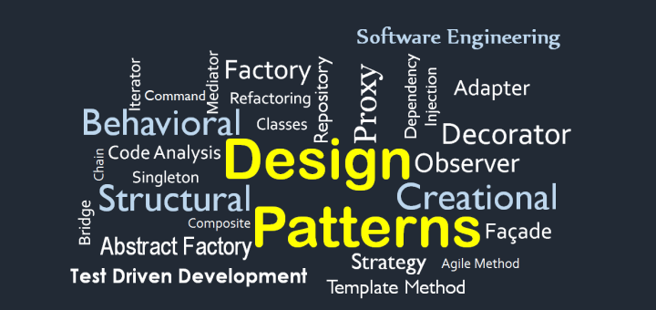

# Design Patterns (Tasarım Kalıpları, Tasarım Desenleri)

Yazılım mühendisliğinde bir tasarım kalıbı, yazılım tasarımında yaygın olarak ortaya çıkan bir soruna genel olarak tekrarlanabilir bir çözümdür. Tasarım deseni, doğrudan koda dönüştürülebilen bitmiş bir tasarım değildir. Birçok farklı durumda kullanılabilecek bir sorunun nasıl çözüleceğine ilişkin bir açıklama veya şablondur.

## Tasarım Kalıplarının Kullanımları

Tasarım kalıpları, test edilmiş, kanıtlanmış geliştirme paradigmaları sağlayarak geliştirme sürecini hızlandırabilir. Etkili yazılım tasarımı, uygulamada daha sonra görünür hale gelmeyebilecek konuların dikkate alınmasını gerektirir. Tasarım kalıplarının yeniden kullanılması, büyük sorunlara neden olabilecek ince sorunları önlemeye yardımcı olur ve kalıplara aşina olan kodlayıcılar ve mimarlar için kod okunabilirliğini artırır.

Çoğu zaman, insanlar yalnızca belirli yazılım tasarım tekniklerinin belirli sorunlara nasıl uygulanacağını anlar. Bu tekniklerin daha geniş bir problem yelpazesine uygulanması zordur. Tasarım kalıpları, belirli bir soruna bağlı özellikler gerektirmeyen bir biçimde belgelenen genel çözümler sağlar.

Ayrıca kalıplar, geliştiricilerin yazılım etkileşimleri için iyi bilinen, iyi anlaşılan adlar kullanarak iletişim kurmasına olanak tanır. Ortak tasarım desenleri zaman içinde geliştirilebilir, bu da onları geçici tasarımlardan daha sağlam hale getirir.

Tasarım kalıpları 3 ayrı kategoride toplanmaktadır. Bunlar;

- [Design Patterns (Tasarım Kalıpları, Tasarım Desenleri)](#design-patterns-tasarım-kalıpları-tasarım-desenleri)
  - [Tasarım Kalıplarının Kullanımları](#tasarım-kalıplarının-kullanımları)
  - [Creational design patterns (Yaratıcı tasarım kalıpları)](#creational-design-patterns-yaratıcı-tasarım-kalıpları)
  - [Structural design patterns (Yapısal tasarım kalıpları)](#structural-design-patterns-yapısal-tasarım-kalıpları)
  - [Behavioral design patterns (Davranışsal tasarım kalıpları)](#behavioral-design-patterns-davranışsal-tasarım-kalıpları)
    - [İçindekiler](#i̇çindekiler)
    - [Nasıl Katkıda bulunabilirim?](#nasıl-katkıda-bulunabilirim)
    - [Katkıda bulunurken dikkat edilmesi gerekenler](#katkıda-bulunurken-dikkat-edilmesi-gerekenler)
    - [Katkıda Bulunanlar ❤️🚀](#katkıda-bulunanlar-️)

---

## Creational design patterns (Yaratıcı tasarım kalıpları)

Bu tasarım kalıpları tamamen sınıf somutlaştırma ile ilgilidir. Bu model ayrıca sınıf yaratma kalıpları ve nesne yaratma kalıplarına ayrılabilir. Sınıf oluşturma kalıpları, örnekleme sürecinde kalıtımı etkin bir şekilde kullanırken, nesne oluşturma kalıpları işi yapmak için yetkilendirmeyi etkili bir şekilde kullanır.

Aşağıdaki tasarım kalıpları Yaratıcı tasarım kalıplarına örnektir;

- Abstract Factory
- Builder
- Factory Method
- Prototype
- [Singleton](./design-patterns/singleton-pattern/README.md)

---

## Structural design patterns (Yapısal tasarım kalıpları)

Bu tasarım kalıpları tamamen Sınıf (`Class`) ve Nesne (`Object`) kompozisyonu ile ilgilidir. Yapısal sınıf oluşturma kalıpları, arabirimleri oluşturmak için kalıtımı kullanır. Yapısal nesne kalıpları, yeni işlevsellik elde etmek için nesneleri oluşturmanın yollarını tanımlar.

Aşağıdaki tasarım kalıpları Yapısal tasarım kalıplarına örnektir;

- Adapter
- Bridge
- Composite
- Decorator
- Facade
- Flyweight
- Private Class Data
- [Proxy](./design-patterns/proxy-pattern/README.md)

---

## Behavioral design patterns (Davranışsal tasarım kalıpları)

Bu tasarım kalıplarının tamamı `Class`'ın nesne iletişimi ile ilgilidir. Davranış kalıpları, nesneler arasındaki iletişimle en özel olarak ilgilenen kalıplardır.

- Chain of responsibility
- Command
- Interpreter
- Iterator
- Mediator
- Memento
- Null Object
- Observer
- State
- Strategy
- Template method
- Visitor

---

### İçindekiler

- [Singleton Pattern](./design-patterns/singleton-pattern/README.md)
- [Proxy Pattern](./design-patterns/proxy-pattern/README.md)
- [Provider Pattern](./design-patterns/provider-pattern/README.md)
- [Container/ Presentational Pattern](./design-patterns/container-presentational-pattern/README.md)
- [Module Pattern](./design-patterns/module-pattern/README.md)

---

### Nasıl Katkıda bulunabilirim?

1. Projeyi forklayın.
2. [issues](https://github.com/baristunar/patterns-dev-tr/issues) bölümünden boştaki bir taskı üzerinize assign edip bir branch açın ve çevirinize başlayabilirsiniz.
3. Not: Assing etmeniz önemlidir çünkü bir başkası aynı taskı alıp çevirisini yapabilir. Bu durumda kimse mağdur olsun istemeyiz.
4. Issuelardaki konular dışında farklı bir pattern çevirisi yapacaksanız kendiniz de issue açıp çevirinize başlayabilirsiniz.
5. Çeviriniz bittikten sonra pull request açabilirsiniz.
6. Çeviri dışında destek olmak isterseniz farklı programlama dillerinde halihazırda çevirisi bulunan patternlere kod örnekleri paylaşabilirsiniz.

---

### Katkıda bulunurken dikkat edilmesi gerekenler

- Readme dosyasına kod bloklarını **image** olarak yüklemeyiniz. Örnek kullanım `console.log("Hello World")`
- Her bir patternin **"Design Patterns"** klasöründe patternin adıyla klasörü açılmalıdır.
- Görsel dosyaları yine patternin kendi klasörü altında **assets** klasöründe depolayınız.
- Son olarak ana readme dosyasında çevirisini yaptığınız patternin klasörüne ilgili pattern [İçindekiler](#i̇çindekiler) bölümünde ve patternin ilgili kategorisinde linklenmelidir. Bkz. [Creational Desing Patterns](#creational-design-patterns-yaratıcı-tasarım-kalıpları), [Structural design patterns](#structural-design-patterns-yapısal-tasarım-kalıpları), [Behavioral design patterns](#behavioral-design-patterns-davranışsal-tasarım-kalıpları).
- Bir çeviri eklerken kaynak belirtmeyi unutmayınız.

---

### Katkıda Bulunanlar ❤️🚀

