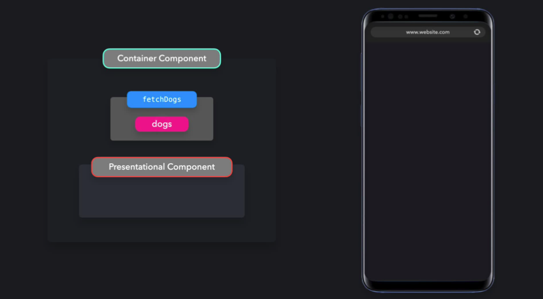
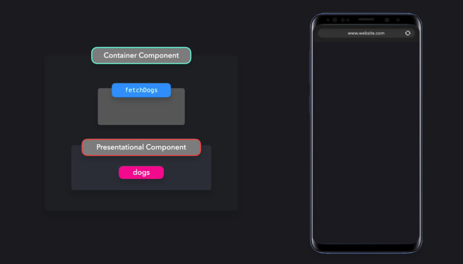
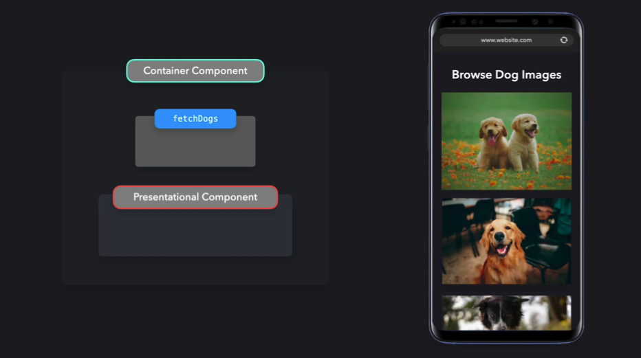
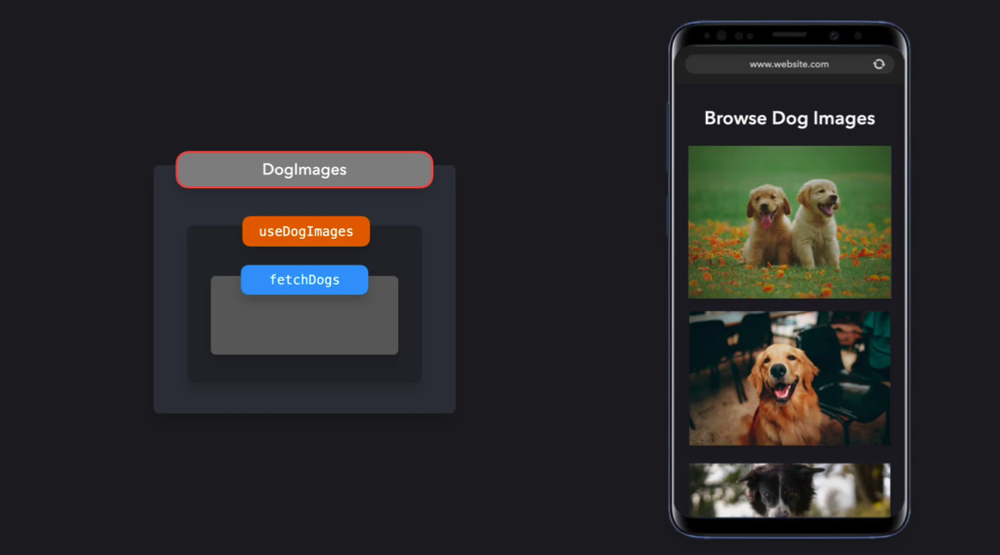

## Container/ Presentational Pattern

*Bu yazı* [Addy Osmani](https://addyosmani.com/) *ve* [Lydia Hallie](https://www.lydiahallie.io/) *tarafından yazılmış olan* [Learning Patterns](https://www.patterns.dev/) *kitabının Container/ Presentational Pattern adlı bölümününün Türkçe çevirisini içermektedir.*

*Yazının devamında kullanacağım Separation of Concerns terimi hakkında bilgi sahibi olmak için  [bu yazıyı](https://medium.com/hesapkurdu-development/mevcut-projede-separation-of-concern-uygulamak-617082d45e85) inceleyebilirsiniz.*

### Separation of concerns aracılığıyla görünüm ve uygulamanın mantığını ayrıştırma

React ile geliştirdiğimiz uygulamaları, seperation of concerns prensibine uygun hale getirmenin bir yolu da Container/Presentational modelini kullanmaktır.

Diyelim ki; 6 adet köpek görselini bir API üzerinden çekerek, bu görselleri ekranda gösterecek bir uygulama yapmak istiyoruz. Böyle bir uygulamayı separation of concerns prensiplerine uygun geliştirmek için iki şeye ihtiyacımız var:

1. **Presentational Components (Sunum Bileşenleri):** Verilerin kullanıcıya nasıl gösterildiğini önemseyen bileşenler. Örnek olarak; ekranda render edilecek olan köpek görselleri.

2. **Container Components (Kapsayıcı Bileşenler):** Kullanıcıya hangi verilerin gösterileceğini önemseyen bileşenler. Örnek olarak; köpek görsellerini bir API üzerinden çekmek.

Köpek görsellerini bir kaynaktan getirmek uygulamanın mantığı (application logic) ile ilgiliyken, bu kaynaktan alınan görsellerin kullanıcıya ne şekilde sunulacağı yalnızca görünüm (view) ile ilgilidir. 

### Presentational Component

Bir sunum bileşeni, prop'lar aracılığıyla veri alır. Birincil amacı prop'lar ile gelen verileri stilize ederek -veri üzerinde herhangi bir değişiklik yapmadan- ekranda göstermektir. Köpek görsellerini ekranda görüntüleyen örneğe gözatalım. Köpek görüntülerini oluştururken, API'dan gelen köpek görsellerini map'lemek ve bu görselleri ekranda göstermek istiyoruz. Bunu yapmak için, verileri prop aracılığıyla alan ve aldığı verileri ekrana yazdıran fonksiyonel bir bileşen oluşturabiliriz.

DogsImages adlı bileşen bir sunum bileşendir. Sunum bileşenlerinin genelde state'ler olmadan çalışırlar: kullanıcı arayüzü tarafında yapılacak olan değişiklikler için kullanılan state'ler haricinde, kendilerine ait React state'leri yoktur.

Sunum bileşenleri verilerini kapsayıcı bileşenlerden alır.

### Container Components

Kapsayıcı bileşenlerin birincil işlevi, verileri kapsadıkları sunum bileşenlerine aktarmaktır. Kapsayıcı bileşenler genellikle sorumlu oldukları veriyi aktardıkları bileşen haricinde herhangi bir bileşeni render etmezler. Bir render işlemine dahil olmadıkları için de herhangi bir stilize işlemi görmezler.

Yaptığımız örnekte, köpek görsellerini DogsImages sunum bileşenine göndermek istiyoruz. Bunu yapmadan önce, görüntüleri harici bir API'dan almamız gerekiyor. Bu verileri getirebileceğimiz bir kapsayıcı bileşen oluşturmamız ve verileri ekranda göstermek adına DogsImages bileşenine aktarmamız gerekiyor.

Bu iki bileşeni birleştirerek görünüm ve uygulama mantığını ayrıştırabiliriz.

#### Hooks

Birçok durumda, Container/Presentational modeli React Hookları ile değiştirilebilir. Hookların çıkması ile birlikte herhangi bir kapsayıcı bileşen kullanmadan kolaylıkla benzer bir sonuç elde edeceğimiz bir yapı oluşturabiliyoruz.

Çekeceğimiz veriyi DogsImagesContainer bileşeninde getirmektense, custom bir hook oluşturup veriyi burada çekebilir ve bunu bir dizi olarak döndürebiliriz.

Bu custom hook'u kullanacağımız için artık DogsImagesContainer bileşeninin DogsImages bileşenini kapsamasına ihtiyacımız yok. Bunun yerine yazdığımız hook'u doğrudan DogsImages bileşeni içerisinde çağırabiliriz.

useDogImages hook'unu kullanarak, uygulama mantığı ve görünüm katmanlarını ayırmış olduk. DogsImages bileşenindeki verileri değiştirmeden yarattığımız hook'tan gelen verileri kullanıyoruz.

 
 

Hooklar sayesinde uygulamanın mantık ve görünüm katmanlarını ayırmak oldukça basitleşti. Bu sayede sunum bileşenini kapsayıcı bileşen ile sardığımız ekstra katmanı aradan çıkartabiliyoruz.

##### Artılar

Container/Presentational modelini kullanmanın bir çok faydası vardır.    

     
Container/Presentational modelini kullanmak separation of concern prensiplerine uygundur. Sunum bileşenleri sadece tasarımdan sorumlu saf fonksiyonlar olabilirken, kapsayıcı bileşenler uygulamanın veri ve state katmanlarından sorumludur. Bu, separation of concerns prensibinin uygulanmasına bir örnektir. 

Sunum bileşenleri kolaylıkla tekrardan kullanılabilir hale getirilebilir, çünkü gösterdiği verilerde herhangi bir değişiklik yapmaz. Bu yüzden bu bileşenleri uygulamanın farklı kısımlarında, farklı amaçlar için yeniden kullanabiliriz.

Sunum bileşenleri uygulamanın mantığını değiştirmediği için bu bileşenleri, kod tabanı hakkında bilgi sahibi olmayan biri tarafından, örneğin bir tasarımcı tarafından kolayca değiştirilebilir. 

Saf fonksiyonlar oldukları için, sunumsal bileşenleri test etmek kolaydır. 

##### Eksiler

Container/Presentational modeli, uygulamanın mantığı ve görünümünü separation of concerns prensiplerine uygun bir şekilde geliştirmeye izin verse de aynı yapıyı React Hooklar ile daha basit bir mantık ile kurabiliriz.

 Container/Presentational modeli, React Hooklarını kullanarak geliştirilse bile küçük boyutlu uygulamada kullanmak için uygun olmayabilir.